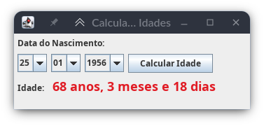

# CALCULADORA DE IDADE EM JAVA COM SWING



Esta é uma calculadora de idade feita em Java e interface com Swing. Possui validadores e muito mais...

### Como utilizar

Abra usando o eclipse ou netbeans ou execute o executável ```CalculadoraDeIdade.jar```

### Requisitos mínimos
É necessário ter Java instalado no computador.
Adquira o java aqui: [https://www.java.com/pt-BR/](https://www.java.com/pt-BR/)
